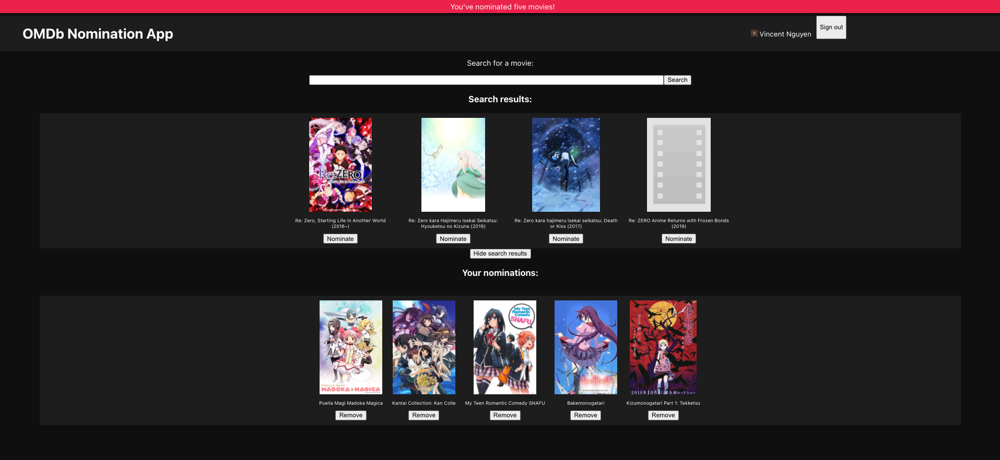

# OMDb Viewer
Created for the [Shopify UX Developer Intern & Web Developer Intern Challenge - Summer 2021](https://docs.google.com/document/d/1AZO0BZwn1Aogj4f3PDNe1mhq8pKsXZxtrG--EIbP_-w/edit?usp=sharing).

Users can search for movies from the [Open Movie Database](http://www.omdbapi.com/) and choose five to nominate. The users' nominations can saved by logging in with their Google account.

Click [here](https://omdb-nv.herokuapp.com/) for a live version of the site.

# Setup
1. Populate `.env` with the required params
2. Run `npm install` to install the project dependencies
3. Start the application with `npm start`

# Todo:
1. Full Firebase support