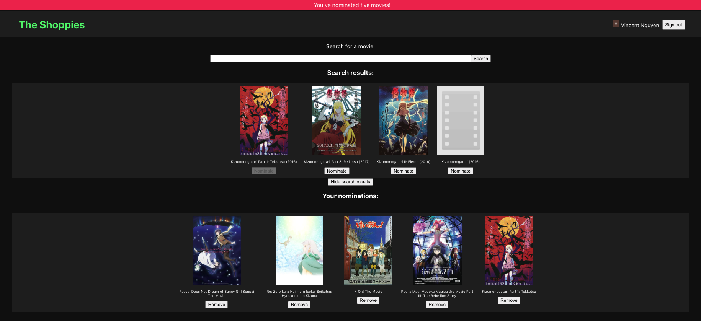

# OMDb Viewer
Created for the [Shopify UI & Web Developer Challenge Summer 2021](https://docs.google.com/document/d/1AZO0BZwn1Aogj4f3PDNe1mhq8pKsXZxtrG--EIbP_-w/edit?usp=sharing).

Users can search for movies from the [Open Movie Databse](http://www.omdbapi.com/) and choose five to nominate. The users' nominations can saved by logging in with their Google account.

# Setup
1. Create a file in the root directory called `.env` and populate it with `REACT_APP_API_KEY=<Your OMDb key>` and `REACT_APP_FIREBASE_KEY=<Your Firebase key>`
2. Run `npm install` to install the project dependencies
3. Start the application with `npm start`

# Todo:
1. Full Firebase support
2. Nominate button state management
3. Deployment onto Heroku